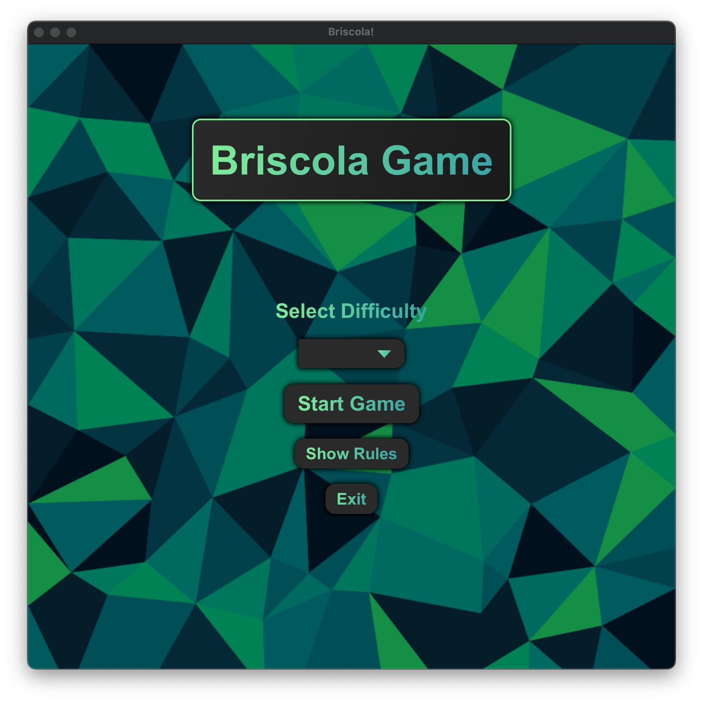
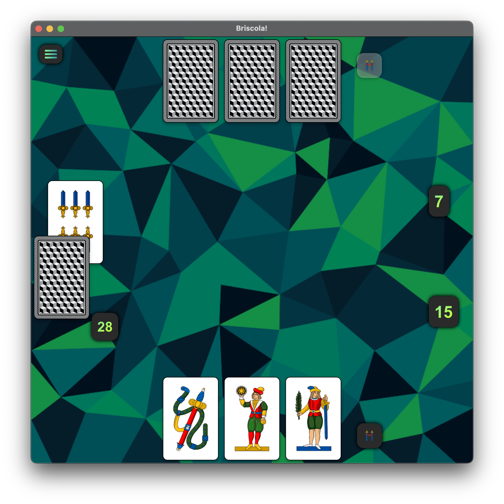
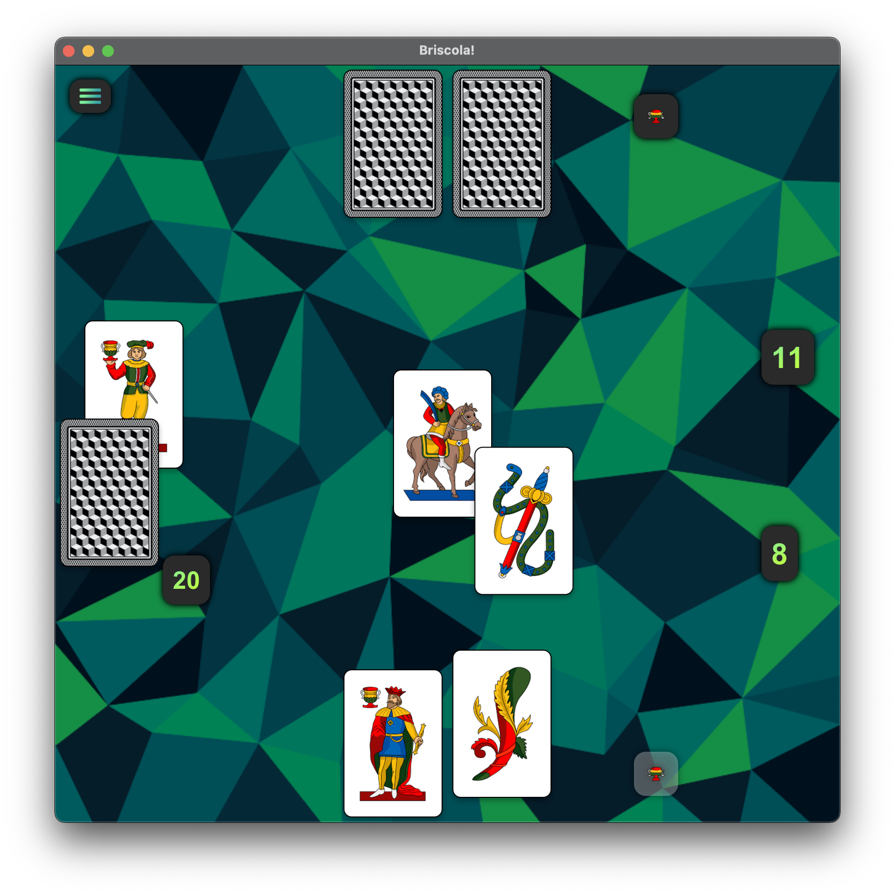

<div align="left">
  
</div>

# Briscola Game
This is a simple implementation of the Italian card game Briscola. The game is played between two players, one of which is the computer. There are three difficulty levels: Easy, Medium, and Hard. The game is played in rounds, and the player with the most points at the end of the game wins.
For more information about the game, see the [Game Description and Rules](#game-description-and-rules) section below.

Usually this game is played with friends and family, but this implementation allows you to play against the computer. 
The scope of the project is to learn and practice object-oriented programming concepts, Java programming, and JavaFX development. 
The project includes a graphical user interface (GUI) that allows players to interact with the game and make decisions. 
JavaFX is used for the graphical user interface in the game, which is written in Java. 
IntelliJ IDEA or any other IDE that supports Maven can easily import the project as it is structured as a Maven project.
## Overview
- **Project Type:** JavaFX Application, Maven Project
- **Scope:** [Object-Oriented Programming Course](#scope)
- **Rules:** [Game Description and Rules](#game-description-and-rules)
- **Technologies:** [Technologies](#technologies)
- **Screenshots:** [Screenshots](#screenshots)
- **Project Structure:** [Project Structure](#project-structure)
- **UML:** [UML](#uml)
## Installation
1. Clone the repository
```bash
git clone
```
2. Open the project in IntelliJ IDEA
3. Run the `Main` class located in `src/main/java/com/cervinschi/marin/javafx/briscola/Main.java`
4. Enjoy the game!

# For Players
## How to Play


## Scope
The project is the final assignment for the course "Object-Oriented Programming" at the *Università di Modena e Reggio Emilia - Unimore*, Faculty of Computer Science and Engineering, Academic Year 2023/2024.
* **Course:** Object-Oriented Programming (https://github.com/nbicocchi/learn-java-core)
* **Professor:** Prof. Nicola Bicocchi

## Technologies
- Java 21.0.2 (https://docs.oracle.com/en/java/javase/21/docs/api/index.html)
- JavaFX (OpenJFX) (https://openjfx.io/)
- JUnit(Jupiter) (https://junit.org/junit5/)
- Maven (https://maven.apache.org/)
- Git (https://git-scm.com/)
- IntelliJ IDEA (https://www.jetbrains.com/idea/)
- Scene Builder (https://gluonhq.com/products/scene-builder/)
- Draw.io (https://app.diagrams.net/)
- UML (https://www.uml.org/)
- Design Patterns (https://refactoring.guru/design-patterns)
- Object-Oriented Programming (https://en.wikipedia.org/wiki/Object-oriented_programming)
- Agile Methodologies (http://agilemanifesto.org)

# Game Description and Rules
**Overview:**
Briscola is a popular Italian trick-taking card game that can be played with 2 to 6 players. The game is typically played with an Italian 40-card deck, which consists of four suits: coins, cups, swords, and clubs. Each suit has 10 cards: Ace, 2, 3, 4, 5, 6, 7, Jack (Fante), Knight (Cavallo), and King (Re).

**Objective:**
The goal of Briscola is to score more points than your opponent(s). Points are scored by winning tricks containing valuable cards. The game is usually played in rounds, and the player or team with the highest cumulative score at the end of the agreed number of rounds wins.

**Card Values:**
Each card has a point value, which is important for determining the winner of a trick and the overall score.

- Ace (Asso): 11 points
- Three (Tre): 10 points
- King (Re): 4 points
- Knight (Cavallo): 3 points
- Jack (Fante): 2 points
- All other cards (2, 4, 5, 6, 7): 0 points

There are 120 points in total in a deck.

**Setup:**
1. Shuffle the deck and deal three cards to each player.
2. Place the remaining deck face down in the center.
3. Turn over the top card of the deck and place it face up under the deck, partially visible. This card determines the Briscola (trump) suit for the game.

**Gameplay:**
1. The player to the right of the dealer leads the first trick by playing a card.
2. The other players, in clockwise order, each play one card.
3. Players must follow suit if they can. If they cannot follow suit, they can play any card, including a trump card.

**Winning Tricks:**
- The trick is won by the highest-ranking card of the suit led, unless a trump card (Briscola) is played.
- If one or more trump cards are played, the highest-ranking trump card wins the trick.

**Continuing Play:**
1. The winner of the trick collects the cards and places them face down in a personal score pile.
2. The winner then draws a new card from the top of the deck, followed by the other players in clockwise order.
3. The winner of the trick leads the next trick.

**End of the Round:**
- The round continues until all cards have been played.
- Players then count the points in their score piles.

**Winning the Game:**
- The player or team with the most points at the end of the round wins.
- In a multi-round game, the player or team with the highest cumulative score at the end of the agreed number of rounds is the overall winner.

**Variations:**
Briscola has several variations, including:
- **Briscola Chiamata:** A team-based version where players bid to determine the trump suit and form temporary alliances.
- **Briscola Scoperta:** All cards are dealt face up, allowing for strategic planning.
- **Briscola a Cinque:** Played with five players where one player is the soloist against the team of four.

Briscola is a game of strategy, memory, and skill. Understanding the value of cards and the dynamics of trick-taking are key to mastering this traditional Italian game. Enjoy playing Briscola!

# Project Structure
<p align="center">
  
</p>

# UML


# Screenshots




# License
This project is licensed under the MIT License - see the [LICENSE](LICENSE) file for details.

# Contribute
If you would like to contribute to this project, please open an issue or create a pull request with your changes. I welcome contributions from the community and am happy to review and merge them.

